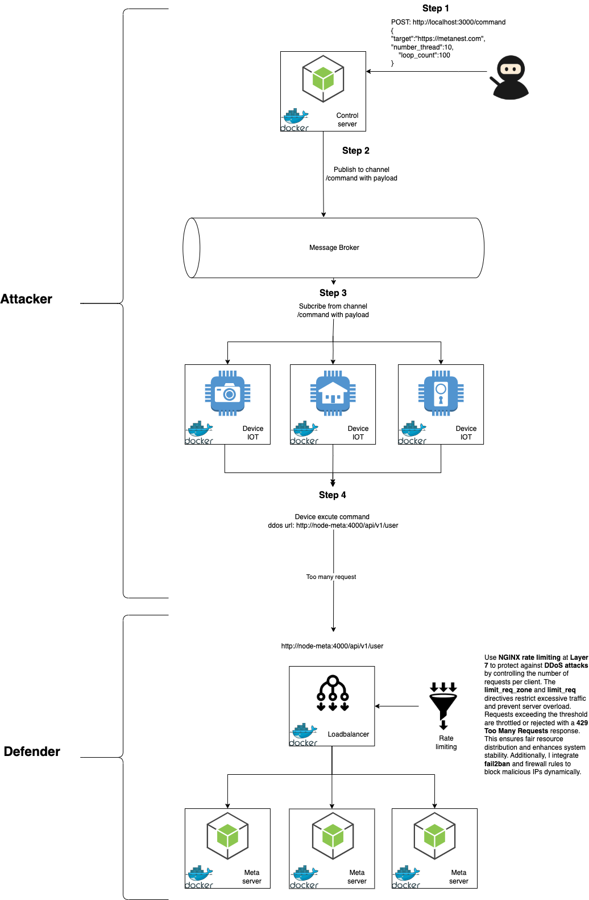

# Perform DDoS Simulation

This project is a simple simulation of a distributed denial-of-service (DDoS) attack. It uses Node.js and Axios to generate HTTP requests to a target URL, with multiple threads and configurable request limits.

> **Disclaimer**: This project is for educational and research purposes only. Unauthorized use of this code to harm, disrupt, or compromise any systems is illegal and unethical.

---

## Features

- Simulates a DDoS attack using multiple threads.
- Configurable:
  - Number of threads.
  - Number of requests per thread.
- Logs detailed information about the progress of each thread.
- Provides a final summary of total requests sent.

---

## Prerequisites

Before running this project, ensure you have:

- **Docker** installed.

---

## Components

1. **MQTT Broker**:
   - Acts as the central communication hub for the botnet.
   - Devices (nodes) subscribe to topics and the server publishes commands to these topics.
   - Implemented using `Eclipse Mosquitto`.

2. **Node Server (Command & Control Server)**:
   - Publishes commands (e.g., attack, stop) to the MQTT broker.
   - Acts as the central controller for the botnet.
   - Listens to responses or updates from devices if necessary.

3. **Node Devices (Bots)**:
   - Subscribes to commands from the MQTT broker.
   - Executes actions based on the commands (e.g., perform a DDoS attack).
   - Reports back status or logs, if configured.

## How it Works

1. The **MQTT broker** is the central hub where the server (Node Server) and devices (Node Devices) communicate.
2. The **Node Server** publishes a command to a specific MQTT topic (e.g., `botnet/command`).
3. All **Node Devices** subscribed to the topic receive the command and execute the associated action (e.g., sending HTTP requests to a target URL).
4. The Docker network ensures all components can communicate seamlessly within an isolated environment.

## Botnet Architecture



## Run Project

1. Clone this repository:
```bash
git clone https://github.com/your-repo-name/ddos-simulation.git
cd ddos-simulation
```
2. Run command to build docker

```bash
docker compose up -d --build
```

3. Start DDOS
- Using postman or curl call api:

POST: http://localhost:3000/command 

Body: 
```bash
{
    "target":"https://metanest.com",
    "number_thread":10,
    "loop_count":100
}
```

- The following parameters can be configured in the script:

targetUrl: The target URL to simulate the attack (e.g., http://example.com).

number_thread: Number of threads (concurrent request generators).

loop_count: Number of requests each thread should send.

## Important Notes
- Ethical Usage:

This simulation is intended for testing and research in controlled environments only.

Do not use this code to target real-world systems or infrastructure.

## Performance:

The speed and effectiveness of this simulation depend on your machine's resources and network bandwidth.

Avoid targeting high-traffic or production websites.


Case 1:
Tấn công ddos, và hệ thống defender chưa tiến hành limit thì chúng ta sẽ thấy server meta bị crask
Case 2:
Tấn công ddos, và hệ thống defender tiến hành ratelimit chống ddos